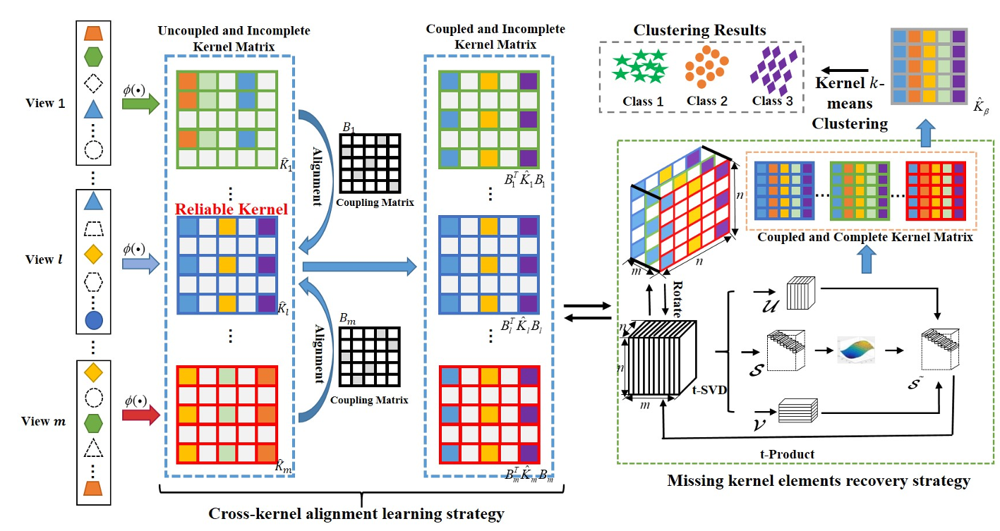
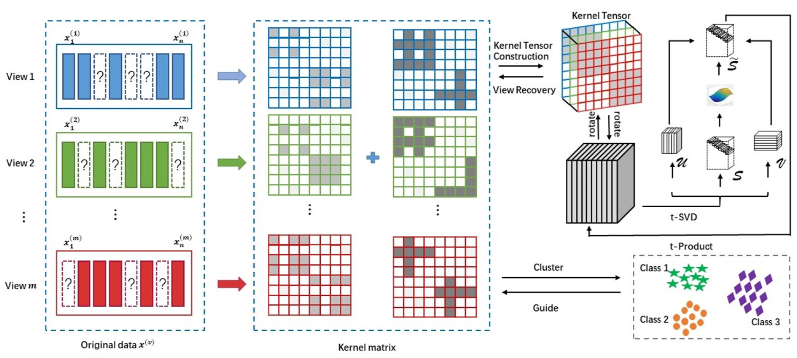

Tingting Wu (吴婷婷) is a PhD student in the School of [Intelligence and Computing, Tianjin University](https://cic.tju.edu.cn/) (TJU), supervised by Prof. [Qilong Wang](https://csqlwang.github.io/homepage/). Her research interests lie in Computer Version and Machine Learning.

🔥 News
======
- 2025.08: I have been invited to serve as a reviewer for TCSVT.
- 2025.06: I graduated from Beijing Jiaotong University with a Master's degree.
- 2025.05: I have been admitted to Tianjin University as a PhD student.
- 2024.12: One paper has been accepted by AAAI 2025 (CCF A).
- 2023.12: One paper has been accepted by AAAI 2024 (CCF A).
  
📑 Publications
------
<table border="0" style="border-collapse: collapse;">
  <tr>
    <td width="300" valign="top" align="center" style="border:none;">
      

        
          AAAI 2025
        
      

      
    </td>
    <td style="border:none;">
      <h3 style="color:blue;">KOALA: Kernel Coupling and Element Imputation Induced Multi-View Clustering</h3>
      
Tingting Wu, Zhendong Li, Zhibin Gu, Jiazheng Yuan, Songhe Feng

      
Annual AAAI Conference on Artificial Intelligence (AAAI)

    </td>
  </tr>
</table>

<table border="0" style="border-collapse: collapse;">
  <tr>
    <td width="300" valign="top" align="center" style="border:none;">
      

        
          AAAI 2024
        
      

      
    </td>
    <td style="border:none;">
      <h3 style="color:blue;"> Low-Rank Kernel Tensor Learning for Incomplete Multi-View Clustering</h3>
      
Tingting Wu, Songhe Feng, Jiazheng Yuan

      
 Annual AAAI Conference on Artificial Intelligence (AAAI)

    </td>
  </tr>
</table>

🏅 Honors and Awards
------
- 2025.06: Excellent Graduated Graduate Student of BeiJing JiaoTong University.(校优秀毕业生)
- 2025.06: Outstanding master thesis of Beijing Jiaotong University.(校优秀硕士论文)
- 2024.12: National scholarship, BeiJing JiaoTong University. (研究生国家奖学金)
- 2024.10: Outstanding Student Cadre, BeiJing JiaoTong University. (校优秀学生干部)
- 2023.10: Outstanding Student, BeiJing JiaoTong University. (校优秀学生)
- 2021.06: Excellent Graduated Graduate Student of ShanDong University of Techonlogy University.(校优秀毕业生)
- 2019.10: Outstanding Student, ShanDong University of Techonlogy University. (校优秀学生)

📖 Educations
------
- 2025.09 - now, Ph.D student, TianJin University, Tianjin, China.
- 2022.09 - 2025.06, Master, BeiJing JiaoTong University, Beijing, China.
- 2018.09 - 2022.06, Undergraduate, ShanDong University of Techonlogy, Shandong, China.

📧 Services
------
- IEEE Transactions on Circuits and Systems for Video Technology (TCSVT)
- ACM Multimedia (ACM MM) 2024
